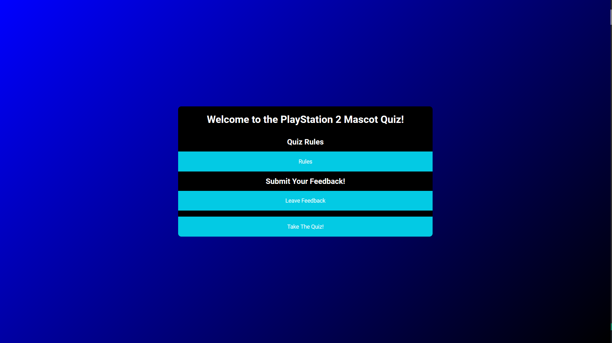

# The Playstation 2 Mascot Quiz

*Insert Responsive Image*

This quiz is to test folks knowledge of the biggest Mascots of the Playstation 2, the best selling home gaming console. With over 155 million units sold world wide, the console has 
several notible mascots, but the three biggest are; Ratchet and Clank, Sly Cooper and Jak and Daxter. All three of these games have multiple entries spanning the history of the PS2, 
some even have releases that go through four of the five Playstation console lineup; with the newest Entry being Ratchet and Clank; A Rift apart. 

## Project Goals

### Design Objectives

- Intuitive Experiance
- Clean Design
- A good selection of questions across all three IPs
- Provide a solid code base for future updates

### User Goals

- As a user, I want to be able to understand what this website is from the landing page. 
- As a user, I want to be able to revert to the homepage and restart the quiz from the end page. 
- As a user, I want to be able to read the rules of the quiz and give feedback from the main page. 

# Existing Features

### Rules and Feedback dynamic Buttons

Featured on the landing page, these two buttons when clicked push the rules of the quiz and a form for feedback onto the page; allowing seemless feedback for the user. 

When the Rules button is clicked again it reverts back to only having the buttons on the page. The same thing applies for the Form button/ 

### The Functionality

The page has a timer that gives the user a simple and clear time to complete the entire quiz. It also has the questions and multiple choice answers below, along with the submit button. 

The results page has custom response messages, depending on the score variable. 

## Testing

The features of the website; that being the landing page and its buttons; the score tracker and custom response messages all give the correct return values. 

I tested all these items by clicking on the buttons to see if it deployed the correct content into the page and tested the custom results messages, making sure they deployed on the correct number of answers.

### Validator 

All the Validator checks came back clear and clean, with no bugs or errors. 

### Bugs

I could find no bugs in the code

## Credits

### Content

All content was written by the developer. 

## Acknowledgements

- My Tutor, Marcel for providing exceptional guidance and valuable constructive criticism.

- My Friends, for their constant source of support and ideas. 

- Code institutes excellent Slack community. 