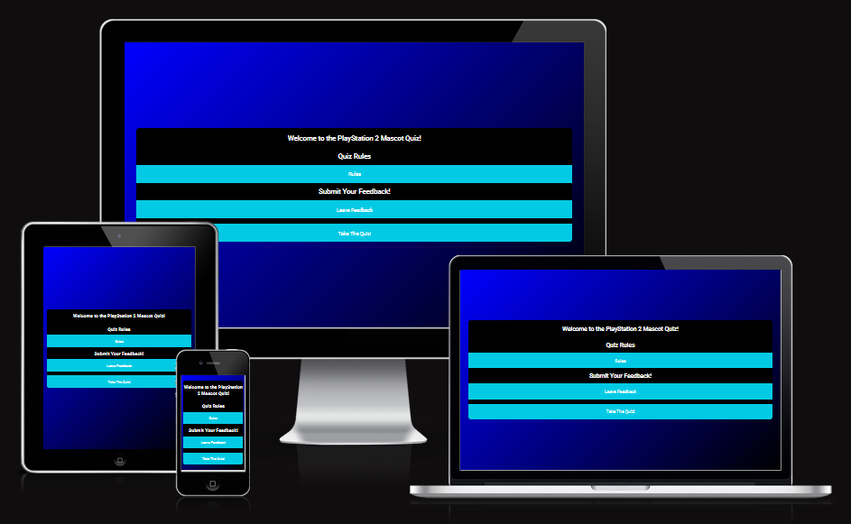

# The Playstation 2 Mascot Quiz

This quiz is to test folks knowledge of the biggest Mascots of the Playstation 2, the best selling home gaming console. With over 155 million units sold world wide, the console has 
several notible mascots, but the three biggest are; Ratchet and Clank, Sly Cooper and Jak and Daxter. All three of these games have multiple entries spanning the history of the PS2, 
some even have releases that go through four of the five Playstation console lineup; with the newest Entry being Ratchet and Clank; A Rift apart. 

You can find a link to the deployed website here; [The Quiz Website](https://mikeyredmon.github.io/Retro-game-quiz/)

## Table Of Contents

    1. Project Goals
       - Design Objectives
       - User Goals
       - Design Ethos
    2. Existing Features
        - Rules an Feedback Buttons
        - Functonality
    3. Testing
        - Manual Testing
        - HTML Validator
        - CSS Validator
        - JavaScript Validator 
        - Bugs
    4. Credits and Acknowledgements

## Project Goals

### Design Objectives

- Intuitive Experiance
- Clean Design
- A good selection of questions across all three IPs
- Provide a solid code base for future updates

### User Goals

- As a user, I want to be able to understand what this website is from the landing page. 
- As a user, I want to be able to revert to the homepage and restart the quiz from the end page. 
- As a user, I want to be able to read the rules of the quiz and give feedback from the main page. 

### Design Ethos. 

When designing the website, I decided that a gradiant background of Blue to Black would be the best option, as those two colours are synonymous with the Playstation 2. This is the same reason I chose the Roboto font as it reminds me of the Playstation 2 font. 

The Welcome and Quiz containers are black with white text for contrast, in order to make them easy to read. 

The buttons on the Welcome and Quiz containers are a light blue and turn green when they are pressed. The Return Home button is black as to stand out from the rest of the buttons as a unique asset. 

# Existing Features

### Rules and Feedback dynamic Buttons

Featured on the landing page, these two buttons when clicked push the rules of the quiz and a form for feedback onto the page; allowing seemless feedback for the user. 

When the Rules button is clicked again it reverts back to only having the buttons on the page. The same thing applies for the Form button/ 

### The Functionality

The page has a timer that gives the user a simple and clear time to complete the entire quiz. It also has the questions and multiple choice answers below, along with the submit button. 

The results page has custom response messages, depending on the score variable. 

There is a return to hompage button, in case a User wishes to return to the Quiz's landing page while in the middle of the quiz. 

## Testing

### Testing User Stories

- As a player, I want the game's website to be easy to navigate.
    - The website has clear, easy to read buttons 
    - The website is well designed and intuitively layed out
- As a player, I want the game to be fun
    - The questions are broad and some can be a real head scratcher
    - Their are several questions across three major PS2 mascots in order to make the content varied
    - The limited time gives a sense of urgency
- As a player, I want easy access to the game rules
    - The rules are avalible from the home page via a button click at any point
- As a player I want the game to be easy to control
    - The buttons and radio question submissions are intuitive 

### Manual Testing

 Device Compatibiliy

|    Device  | Outcome | Pass/Fail |
| ----------- | ----------- | ------------- |
| Samsung Galaxy S10+ | No apperance, responsivness nor functionality issues | Pass |
| iPad | No apperance, responsivness nor functionality issues | Pass |
| iPhone 12/13 mini | No apperance, responsivness nor functionality issues | Pass |
| Kindle Fire | No apperance, responsivness nor functionality issues  | Pass |
| iPhone Se Second Gen | No apperance, responsivness nor functionality issues| Pass |

### Validator 

All the Validator checks came back clear and clean, with no bugs or errors. 

## Technologies Used

HTML5, CSS3 and Javascript. 

### Bugs

I could find no bugs in the code

## Credits

### Content

All content was written by the developer. 

## Acknowledgements

- My Tutor, Marcel for providing exceptional guidance and valuable constructive criticism.

- My Friends, for their constant source of support and ideas. 

- Code institutes excellent Slack community. 